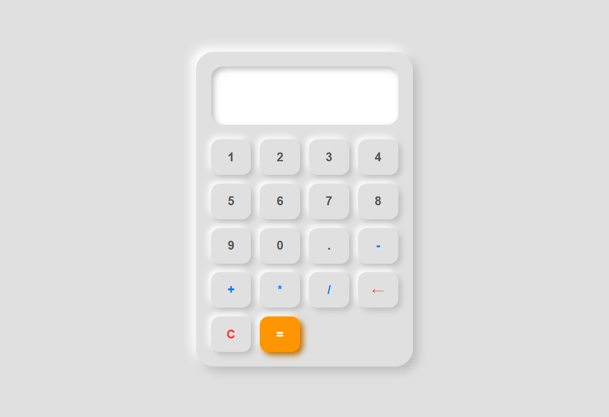

# Calculadora

Um aplicativo de calculadora web funcional construído como parte do currículo da fundação **The Odin Project**. O design foi totalmente customizado utilizando o estilo para simular um dispositivo físico realista, com interações táteis nos botões.

> 🚀 [Clique aqui para testar o projeto no GitHub Pages](https://rikkyrs.github.io/Calculadora/)


## 📸 Demonstração

 

## Funcionalidades

- **Operações Básicas:** Adição, subtração, multiplicação e divisão.
- **Histórico e Interface Dinâmica:** Visor amplo com suporte a números decimais.
- **Efeitos Visuais Reais:** Botões que simulam um clique físico (afundam ao serem pressionados) e reagem ao passar o mouse.
- **Botões de Controle:** Função para apagar o último dígito inserido (`←`) e limpar todo o visor (`C`).

---

## Tecnologias Utilizadas

- **HTML5:** Estruturação semântica e mapeamento de eventos dinâmicos.
- **CSS3:** Uso avançado de **CSS Grid** para o teclado numérico, **Flexbox** para centralização e propriedades de `box-shadow` (com o efeito `inset`) para criar a estética Neumórfica.
- **JavaScript (Vanilla):** Lógica de programação, manipulação do DOM, controle de operadores e processamento de strings matemáticas.

---

## Aprendizados (The Odin Project)

Este projeto foi fundamental para consolidar os seguintes conceitos de desenvolvimento:
1. **Lógica de Estados:** Como gerenciar os números digitados, o operador atual e o resultado sem misturar os valores na memória do JavaScript.
2. **Casos de Borda (Edge Cases):** Tratamento de erros matemáticos clássicos, como impedir a divisão por zero ou evitar que o usuário digite múltiplos pontos decimais (`..`) em um mesmo número.
3. **CSS Avançado:** Domínio sobre o sistema de Grid, responsividade e especificidade de seletores CSS para criar interfaces táteis altamente interativas.

---

## Como Executar o Projeto Localmente

Se quiser rodar este projeto na sua máquina:

1. Clone o repositório:
   ```bash
   git clone https://github.com
   ```
2. Navegue até a pasta do projeto:
   ```bash
   cd nome-do-repositorio
   ```
3. Abra o arquivo `index.html` em qualquer navegador web.

---

Desenhado e desenvolvido por [Henrique Rodrigues](https://github.com/RikkyRS).
